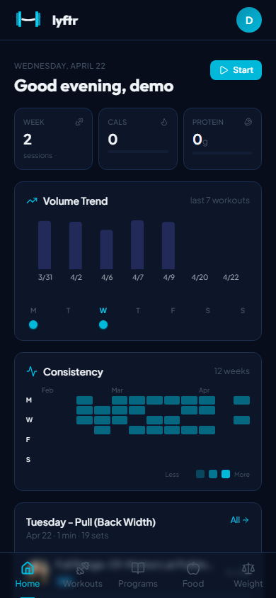
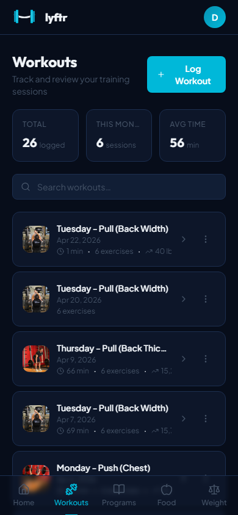
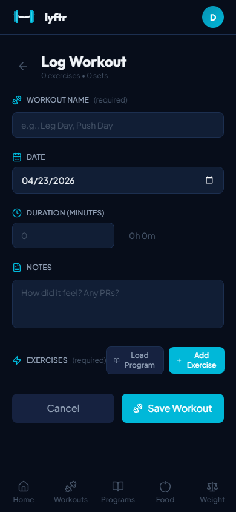
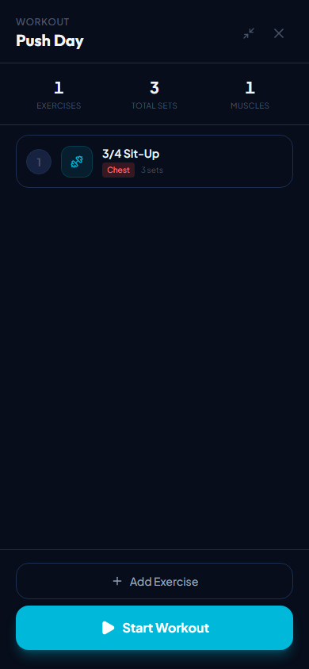
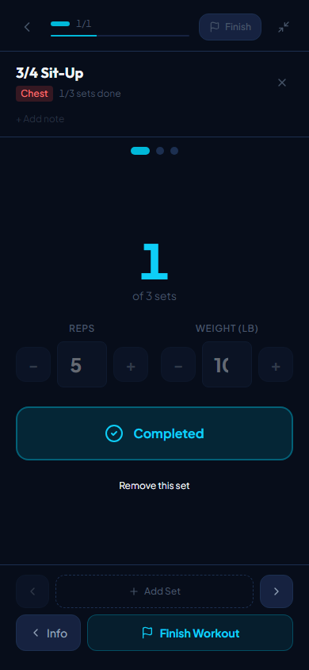
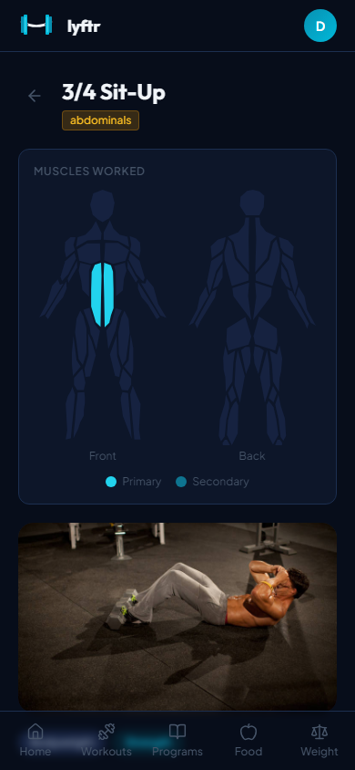
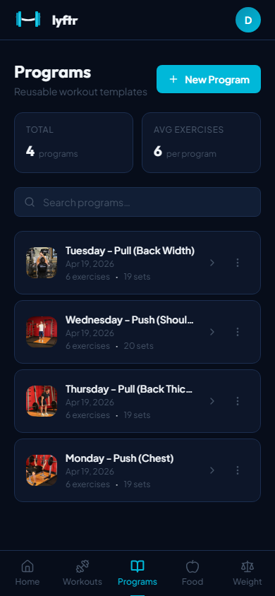
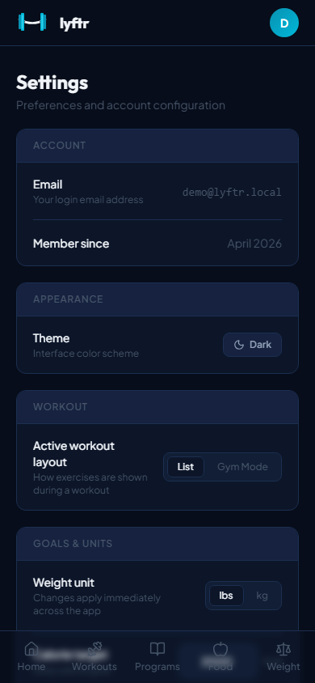
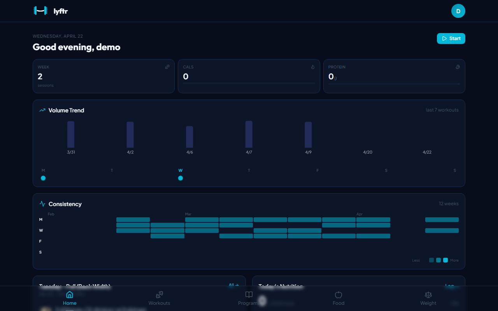
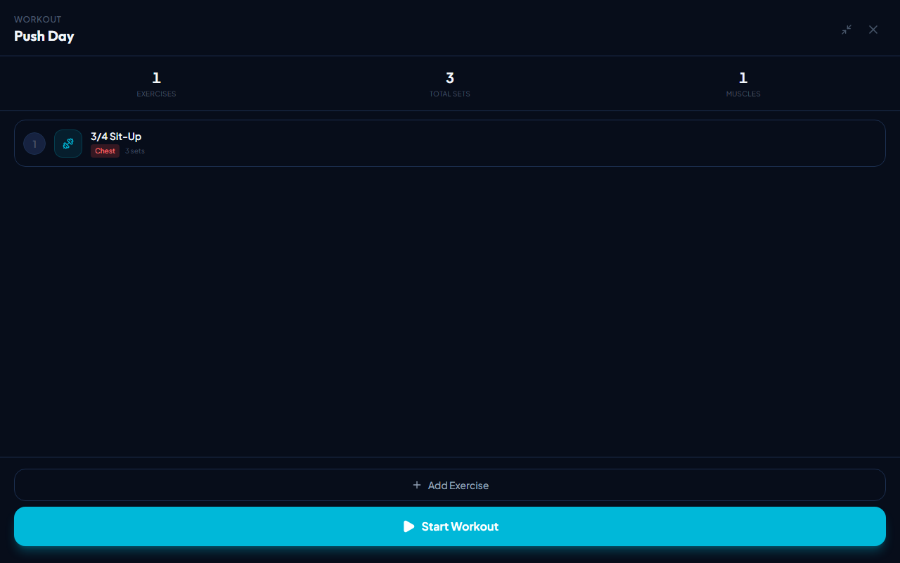

<h1 align="center">Lyftr</h1>

<p align="center">
  <strong>Self-hosted fitness tracker. Your data, your server.</strong>
</p>

<p align="center">
  <a href="LICENSE"></a>
  
  <a href="https://hub.docker.com/r/cwlumm/lyftr-backend"></a>
  
</p>

<p align="center">
  
  
  
  
</p>

<p align="center">
  
  
  
  
</p>

<p align="center">
  
</p>

<p align="center">
  
</p>

> **Early beta** — actively being built. Expect rough edges and frequent updates. Issues and feedback are welcome. The software equivalent of going to the gym for the first time.

> **First official beta release coming soon** — stay tuned. Unlike your scheduled rest day, this one won't keep getting pushed back.

---

## Features

| Feature | Web |
|---------|-----|
| Workout logging with 800+ exercise library | ✓ |
| Program builder — reusable workout templates | ✓ |
| Active workout mode — guided set-by-set flow | ✓ |
| Gym Mode — full-screen card layout, one exercise at a time | ✓ |
| Exercise detail — personal records, progression chart, muscle diagram | ✓ |
| Dashboard — volume trends, consistency heatmap, muscle balance | ✓ |
| Self-hosted — all data stays on your server | ✓ |
| Nutrition tracking — calories and macros | In progress |
| Weight tracking with trend graph | In progress |

---

## Quick Start

> No clone. No build. No Go install required. Just Docker.

```bash
curl -o docker-compose.yml https://raw.githubusercontent.com/Cawlumm/lyftr/main/docker-compose.yml
curl -o .env https://raw.githubusercontent.com/Cawlumm/lyftr/main/.env.example
```

Edit `.env` and set a strong `JWT_SECRET` (32+ characters), then:

```bash
docker compose up -d
```

Open `http://localhost` in your browser and create your account. If running on a VPS, replace `localhost` with your server IP or domain.

---

## Configuration

All variables live in `.env` at the project root.

| Variable | Default | Description |
|----------|---------|-------------|
| `JWT_SECRET` | *required* | Min 32-char secret for signing tokens |
| `CORS_ORIGIN` | `http://localhost` | Set to your domain in production |
| `PORT` | `80` | Host port for the web interface |

---

## Exercise Library

On first startup, Lyftr automatically seeds 800+ exercises from [free-exercise-db](https://github.com/yuhonas/free-exercise-db) in the background. No API key. No setup required. It just works.

```
[startup] exercises table empty — fetching from free-exercise-db...
[startup] seed: synced 868 exercises
```

The seed runs async so the server is immediately available. Exercises appear in the UI within a few seconds.

**Re-sync exercises:**

Go to **Settings → Exercise Library** — shows current exercise count and an in-progress indicator while seeding. Hit **Re-sync** to pull the latest exercises from the source (safe upsert, existing workout data is untouched).

---

## Data & Backups

All workout data is stored in `./data/lyftr.db` (SQLite). Back this up regularly. It's one file. You have no excuse.

```bash
# Backup
cp ./data/lyftr.db ./data/lyftr.db.backup

# Update to latest
docker compose pull && docker compose up -d
```

---

## Running on a VPS

> Because paying $15/month for a fitness app subscription is money better spent on protein powder.

```bash
sudo apt update && sudo apt install -y docker.io docker-compose-plugin

mkdir lyftr && cd lyftr
curl -o docker-compose.yml https://raw.githubusercontent.com/Cawlumm/lyftr/main/docker-compose.yml
curl -o .env https://raw.githubusercontent.com/Cawlumm/lyftr/main/.env.example
nano .env   # set JWT_SECRET and CORS_ORIGIN

docker compose up -d
```

For HTTPS, put Lyftr behind Caddy or nginx with a Let's Encrypt certificate.

---

## Roadmap

- [x] Workout logging + program builder
- [x] Active workout mode (list + gym mode layouts)
- [x] Exercise detail — PRs, progression chart, muscle diagram
- [x] Dashboard with charts and trends
- [x] Docker deployment with E2E test pipeline
- [ ] Nutrition tracking — in progress
- [ ] Weight tracking — in progress
- [ ] PWA — installable on any device
- [ ] iOS app (Swift)
- [ ] Hosted option (no self-hosting required)

---

## Tech Stack

| Layer | Technology |
|-------|-----------|
| Backend | Go, Gin, SQLite |
| Frontend | React, TypeScript, Tailwind CSS, Vite |
| Auth | JWT with refresh tokens |
| Deployment | Docker, nginx |

---

## Development

```bash
# Backend (runs on :3000)
cd backend && go run main.go

# Frontend (runs on :5173, proxies /api to :3000)
cd web && npm install && npm run dev
```

See `backend/config/config.go` for all supported environment variables.

---

## Contributing

Bug reports, feature requests, and pull requests are all welcome. Open an issue before submitting large changes — unlike leg day, communication should not be skipped.

---

## License

[MIT](LICENSE)
