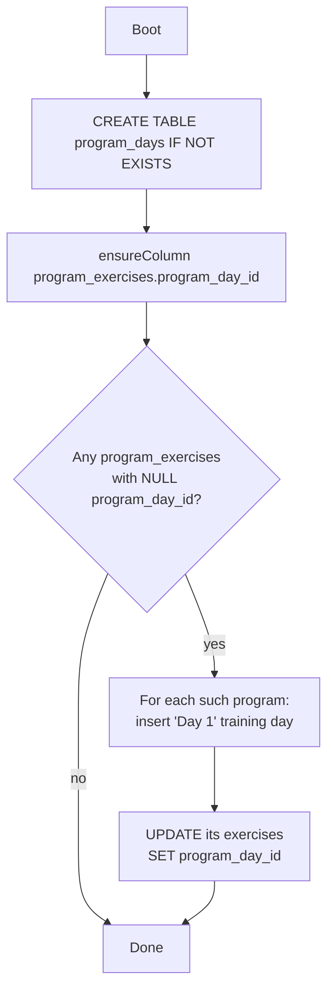
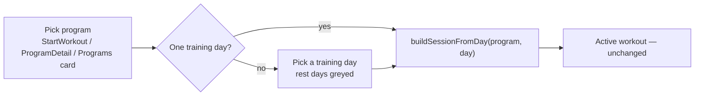

# Program Days — Design Spec

**Date:** 2026-07-19
**Branch:** `feat/program-days`
**Status:** Revised after backend + frontend review, pre-implementation

**Revision 2** folds in a dev + frontend design review. Backend: duplicated test
schema (B1), demo seed writing NULL day-ids at runtime (B2), validate-before-wrap
ordering (B3), hollow concurrency test + 3-level cursor discipline (B4), first-day-only
flattened field for mobile (B5). Frontend: three start-workout entry points not one
(finding 1), ProgramPicker is the pre-fill flow not start (2), dead builder modals (3),
nested state/reorder/keys (4), collapse transitions (5), rest-toggle hide-not-clear (6),
client validation rewrite (7), display grouping (9). Data-model core (retain
`program_id`, SQLite FK-column add, cascade order) confirmed sound.

## Problem

Lyftr programs are a flat, single ordered list of exercises:

```
programs
  └─ program_exercises   (order_index, rest_seconds)
       └─ program_sets    (set_number, target_reps, target_weight)
```

There is no grouping layer, so a real training split (Upper/Lower, Push/Pull/Legs)
cannot be represented. There is no notion of days, no rest days, and no way to
start "day 2" of a program. Users can only fake splits by creating one program
per day.

## Goal

Introduce a **day** layer so a program is an ordered list of named days, each
either a training day (has exercises) or a rest day (marker only). When starting
a workout, the user picks which training day to run.

```
programs
  └─ program_days        (NEW: name, order_index, is_rest_day)
       └─ program_exercises   (gains program_day_id; keeps program_id)
            └─ program_sets
```

## Decisions (locked during brainstorming)

| Decision | Choice |
|---|---|
| Scheduling model | **Named days, manual pick.** No calendar/weekday mapping, no auto-advancing cycle. Days are an ordered, named list; the user picks a day when starting a workout. |
| Rest days | Non-startable markers in the day list. They carry no exercises. |
| Structure | **Every program has ≥1 day.** A "simple" routine is a 1-day program; the builder collapses day chrome when there is exactly one day. Single code path — no flat-vs-day branching. |
| Frontends in scope | **Web only.** Mobile (`mobile/`) untouched, but API compatibility is preserved (see below). |
| Existing data | Auto-migrated: each existing program gets one training day named "Day 1" owning its current exercises. |

## Data model

### New table

```sql
CREATE TABLE IF NOT EXISTS program_days (
  id          INTEGER PRIMARY KEY AUTOINCREMENT,
  program_id  INTEGER NOT NULL REFERENCES programs(id) ON DELETE CASCADE,
  name        TEXT    NOT NULL,
  order_index INTEGER NOT NULL DEFAULT 0,
  is_rest_day INTEGER NOT NULL DEFAULT 0
);
CREATE INDEX IF NOT EXISTS idx_program_days_program ON program_days(program_id, order_index);
```

### Altered table

`program_exercises` gains `program_day_id`:

```sql
ALTER TABLE program_exercises ADD COLUMN program_day_id INTEGER
  REFERENCES program_days(id) ON DELETE CASCADE;
```

**`program_id` on `program_exercises` is retained.** The auto-progression code
(`stores/workout_progression.go`, `suggestTargetsTx`, `ResolveSuggestions`) joins
`program_sets → program_exercises` on `pe.program_id`. Keeping that column means
none of the progression SQL changes and the IDOR guards stay intact. Exercises are
now *grouped and loaded* by `program_day_id`; `program_id` is a denormalized parent
pointer kept in sync on every write.

### Migration / backfill

Follows the existing idempotent pattern in `backend/db/migrations.go`
(`ensureColumn` + `PRAGMA table_info`). On boot:

1. `CREATE TABLE IF NOT EXISTS program_days` (added to the `schema` const).
2. `ensureColumn("program_exercises", "program_day_id", ...)`.
3. **Backfill** (runs only when there is orphaned data): for every program that
   has `program_exercises` with `program_day_id IS NULL`, create one
   `program_days` row (`name='Day 1'`, `order_index=0`, `is_rest_day=0`) and set
   those exercises' `program_day_id` to it. Idempotent: a second boot finds no
   NULL rows and does nothing.



## Backend changes

### models.go

```go
type Program struct {
    ID        int64        `json:"id"`
    UserID    int64        `json:"user_id,omitempty"`
    Name      string       `json:"name"`
    Notes     string       `json:"notes"`
    CreatedAt time.Time    `json:"created_at"`
    Days      []ProgramDay `json:"days"`
    // Exercises retained as a READ-ONLY flattened convenience field for the
    // untouched mobile client and any legacy consumer. It carries the FIRST
    // training day's full ProgramExercise rows (ids, rest_seconds, sets with
    // ids) — NOT all days concatenated. Rationale: mobile's "start workout"
    // maps program.exercises into a session; concatenating every day would make
    // mobile launch one giant all-days session. First-day mirroring keeps
    // mobile's start-workout behaving as "start day 1" until mobile gets a
    // proper day picker. Never populated from requests. (See review finding B5.)
    Exercises []ProgramExercise `json:"exercises"`
}

type ProgramDay struct {
    ID         int64             `json:"id,omitempty"`
    ProgramID  int64             `json:"program_id,omitempty"`
    Name       string            `json:"name"`
    OrderIndex int               `json:"order_index"`
    IsRestDay  bool              `json:"is_rest_day"`
    Exercises  []ProgramExercise `json:"exercises"`
}
```

`ProgramExercise` gains `ProgramDayID int64 json:"program_day_id,omitempty"`.

Request types nest days:

```go
type CreateProgramRequest struct {
    Name  string                `json:"name" validate:"required"`
    Notes string                `json:"notes"`
    Days  []CreateProgramDayReq `json:"days" validate:"max=14,dive"`
    // Legacy flat field: if Days is empty and Exercises is non-empty, it is
    // wrapped into a single "Day 1" training day. Preserves old web/mobile writes.
    // PRECEDENCE: when Days is non-empty, Exercises is ignored entirely (Days
    // wins) — no merging, no 400. Documented so it isn't resolved arbitrarily.
    Exercises []CreateProgramExerciseReq `json:"exercises" validate:"omitempty,max=500,dive"`
}

type CreateProgramDayReq struct {
    Name      string                     `json:"name"`
    IsRestDay bool                       `json:"is_rest_day"`
    Exercises []CreateProgramExerciseReq `json:"exercises" validate:"max=500,dive"`
}
```

**Caps:** max 14 days per program; existing per-exercise/per-set caps unchanged.

### stores/program.go

- **`normalizeProgramReq(req)` helper (runs BEFORE controller validation, see the
  controller note):** if `req.Days` is empty and `req.Exercises` is non-empty, return
  a copy whose `Days` is one training day `{Name:"Day 1", IsRestDay:false, Exercises:
  req.Exercises}`. If `req.Days` is non-empty, drop `req.Exercises`. This makes the
  legacy flat path and the zero-training-days validation agree (review finding B3).
- `insertProgramExercises` → split into `insertProgramDays(tx, pid, days)` which,
  per day, inserts the `program_days` row then its exercises (passing both
  `program_id` and `program_day_id`). `order_index` is day-local (restarts per day)
  and derived from array position; exercise `order_index` likewise resets per day.
- `loadExercises` → `loadDays(programID)`: load days ordered by `order_index`,
  then per day load its exercises, then per exercise its sets. **Cursor discipline:**
  fully scan + `Close()` each parent cursor before loading its children at ALL THREE
  levels (days → exercises → sets), extending the #36 fix one level deeper — mandatory
  under `SetMaxOpenConns(1)` or the pool deadlocks. Populate `Program.Days` (all days)
  and the flattened `Program.Exercises` (first training day only, per the models note).
  Acknowledged cost: `List` now does `programs × days × exercises` sequential
  round-trips on one connection — an N+1 latency multiplier, not a deadlock.
- `Create` / `Update` / `Get` / `List` / `get`: swap `loadExercises` for `loadDays`
  and `insertProgramExercises` for `insertProgramDays`. `Update` deletes
  `program_days WHERE program_id = ?` (which cascades to `program_exercises` and
  `program_sets`) before re-inserting; the standalone `DELETE program_exercises` is
  redundant given the cascade and may be dropped.
- Progression functions (`suggestTargetsTx`, `ResolveSuggestions`, `SuggestTargets`):
  **unchanged** — they key off `program_id` and `program_set_id`, both preserved.

### Other backend files that MUST change in lockstep (review findings B1, B2, B4)

These are not optional — the change silently breaks without them:

- **`controllers/testhelper_test.go`** — `applySchema()` is a hand-maintained SECOND
  copy of the schema that tests run against; it does not call `migrate()`. Add the
  `program_days` table and `program_exercises.program_day_id` column here, kept in
  sync with the `schema` const. Without this every program test fails at runtime.
- **`seed/demo_data.go`** — `seedProgram` inserts `program_exercises` directly with no
  day and runs on EVERY boot, after backfill. It must create `program_days` rows and
  set `program_day_id`. It already iterates 6 splits (Push/Pull/Legs A+B) that it
  currently flattens into one program — turn those into 6 real days.
- **`controllers/concurrency_test.go`** — `TestListProgramsConcurrentDoesNotExhaustPool`
  seeds `program_exercises` with no day; after the change `loadDays` returns them under
  no day and the test stops exercising the nested loader it guards. Seed a `program_days`
  row + `program_day_id` so it keeps testing the #30/#36 invariant.
- **Backfill must be a callable, testable function** (not inlined in `alterMigrations`,
  which `log.Fatalf`s on the global `db.DB` and is never invoked by tests) so the
  "migrate → assert Day 1" test can drive it directly.

### controllers/programs.go

- Call `normalizeProgramReq` (the store helper) **first**, so the legacy flat path
  is wrapped into a Day 1 before the zero-training-days check runs (finding B3).
- Then validate:
  - Each day `name` defaults to "Day N" (by order) when blank.
  - A rest day carrying exercises → 400 (rest days are markers only).
  - A program with zero training days → 400 (there must be something to run).
  - A training day may have zero exercises (allowed mid-build; starting from it
    just yields an empty session, same as quick-start).
  - More than 14 days → 400.
- Otherwise thin pass-through; ownership + tx already handled in the store.

### No route changes

`GET/POST/PUT/DELETE /programs` and `/programs/:id/suggestions/resolve` keep their
paths and verbs. Only request/response bodies gain the `days` array.

## Web changes

### types.ts / services/api.ts

Mirror the nested shape: add `ProgramDay`, add `days` to `Program`, add
`program_day_id` to `ProgramExercise`. Program-level counts (cards, detail header)
sum across `days`, not the flattened `exercises` field (which is now first-day only).

### Program builder — AddProgram.tsx / EditProgram.tsx pages ONLY

The `AddProgramModal.tsx` / `EditProgramModal.tsx` components are **dead code** (never
imported; already stale — missing the `rest_seconds`/`RestPicker` the pages have). The
live builders are the two pages behind `/programs/new` and `/programs/:id/edit`. Scope
the day work to the pages; delete the dead modals in this effort or declare them
explicitly out of scope. Do NOT rebuild day UI into the dead files (finding 3).

**State shape:** `days: { name: string; is_rest_day: boolean; exercises: [...] }[]`.
Every existing index-based mutator (`exercises[i].sets[j]`) gains a `dayIdx` axis. The
current builders shallow-copy and mutate nested arrays semi-in-place, which will alias
day/exercise/set objects across renders once nested — mutators must copy at each level
they touch (finding 4).

- Day sections (stacked): each day has a name field, a rest-day toggle, and its own
  exercise list reusing the existing add/set/`RestPicker` editors.
- "Add day" / "Add rest day" buttons; delete day; reorder days via **up/down buttons**
  (no drag lib in the repo; matches the "no cross-day drag" YAGNI cut).
- `order_index` is derived from array position **at submit time** (matches how sets
  renumber today) — not tracked live on every reorder.
- **Stable client-side keys:** days/exercises need stable local ids (e.g. a client
  uuid on add), NOT array-index keys, or reorder scrambles input focus and controlled
  values (finding 4).
- **Collapse rule (finding 5):** day chrome (name field, rest toggle, reorder handles)
  is visible iff `days.length > 1`. A lone day renders exactly like today's flat
  builder; its name is implicit ("Day 1", filled server-side). Names are held in state
  even while hidden and are NEVER reset when collapsing/expanding — adding or removing
  days only toggles visibility.
- **Rest-day toggle = HIDE, not clear (finding 6):** toggling rest on retains the day's
  exercises in local state (rendered collapsed/greyed) but STRIPS them from the submit
  payload (the backend 400s on a rest day carrying exercises). Toggling back off
  restores them. No silent data loss.
- **Client validation rewritten to mirror the backend 400s (finding 7):** the pages
  currently hard-block on `exercises.length === 0`. Replace with: ≥1 training (non-rest)
  day required; ≤14 days; rest days carry no exercises (enforced by the hide rule). These
  pre-submit checks are the primary guard so users rarely hit a raw backend 400
  (finding 8); surface the error scoped to the offending day where practical.

### Start-workout flow — ALL entry points (finding 1, the key correctness gap)

The `program.exercises → ActiveSessionExercise` mapping (with `program_set_id` linkage)
is inlined in **three** start-workout entry points today, not one. After migration the
flattened field is first-day-only, so any uncovered button silently starts the wrong
session. Extract ONE shared helper `buildSessionFromDay(program, day)` and route all
three through it plus a day picker:

- `pages/StartWorkout.tsx` — `startFromProgram` (its own inline program list).
- `pages/ProgramDetail.tsx` — `handleStart`, the prominent "Start Workout" button.
- `pages/Programs.tsx` — `ProgramCard.handleStart`, the card action.

Day picker: after selecting a program, present its training days (rest days greyed,
non-selectable). A single-training-day program skips the picker and starts directly.
Everything downstream (active session, set logging, `program_set_id`, progression) is
unchanged.

**Separate flow — do not conflate:** `components/ProgramPicker.tsx` is the ad-hoc
workout **pre-fill** picker (used by `AddWorkout.tsx` / `AddWorkoutModal.tsx` via
`loadFromProgram`), NOT a start-workout flow. It also needs a day choice before
flattening exercises into the workout form; for v1 default it to the **first training
day** (parity with the flattened field) and note it. (`loadFromProgram` is duplicated
across the two consumers and already diverges on `rest_seconds` — consolidate while
here.) (findings 1, 2)



### Program display (finding 9)

- `ProgramDetail.tsx`: group exercises under day headings; show rest days as greyed
  markers; header stats sum across training days. The header image (`exs[0]...`) becomes
  first exercise of the first training day — acceptable.
- `Programs.tsx` cards: surface day count alongside the exercise count
  (e.g. "3 days · 18 exercises") so a multi-day split isn't shown as one flat pile.

## Testing

**Go (table-driven, matching existing style):**
- Store round-trip: create multi-day program (incl. a rest day) → get → assert day
  order, rest flag, per-day exercises/sets.
- Legacy write path: flat `Exercises` + no `Days` wraps into a single "Day 1", and the
  create response still returns a populated flattened `exercises` (guards
  `TestCreateProgram_success`, `e2e/programs.spec.ts` seed helper).
- Precedence: both `days` and `exercises` set → `exercises` ignored, `days` used.
- `program_id` stays in sync with each exercise's day's program on write (finding C2).
- IDOR: a client-supplied `program_day_id` on a request exercise is ignored — the store
  generates day ids (finding C4).
- Backfill migration: seed a pre-days program (exercises with NULL `program_day_id`),
  run the callable backfill fn, assert one "Day 1" owns them; second run is a no-op.
- Validation: rest day with exercises → 400; zero training days → 400; >14 days → 400.
- Cascade: delete program removes days/exercises/sets; delete day removes its children.
- Progression regression: existing `progression_test.go` / `programs_test.go` still pass
  unchanged (proves `program_id` retention worked).
- Updated harness/seed compile+run: `testhelper_test.go` `applySchema`, `demo_data.go`
  `seedProgram`, and `concurrency_test.go` seed all carry the day layer (findings B1/B2/B4).

**Web (Playwright, extend `e2e/programs.spec.ts`):**
- Build a 2-training-day + 1-rest-day program, save, reload, assert structure.
- Start a workout from a specific day (via ProgramDetail's button — tightens the
  existing `start program creates workout session` test to assert exercise membership,
  not just URL) and confirm the session holds that day's exercises only.
- Rest-day toggle round-trip: toggle on → save → reload → exercises absent from payload
  but restorable in-form (hide-not-clear).
- Client validation: zero-training-day and >14-day submissions blocked before network.
- Legacy render: an existing (pre-days) program still opens in EditProgram and starts.

## Backward compatibility summary

| Consumer | Effect |
|---|---|
| Existing DB | Auto-migrated to 1-day programs on first boot; no data loss. |
| Web app | Updated in this effort. |
| Mobile app | Not updated. Reads work: the flattened `exercises` field is first-training-day only, so mobile "start workout" launches day 1 (not all days concatenated — the bug avoided per B5). Writes work: legacy flat `exercises` wrapped into "Day 1". Known limitation: mobile sees/starts only day 1 of a multi-day program until it gets a day picker. |
| Progression / suggestions | Untouched; `program_id` + `program_set_id` preserved. |

## Out of scope (YAGNI)

- Weekday/calendar mapping and auto-advancing cycles.
- Program-level scheduling, streaks, or "today's workout" logic.
- Mobile multi-day authoring UI.
- Reordering exercises *across* days via drag (reorder within a day only for v1).
