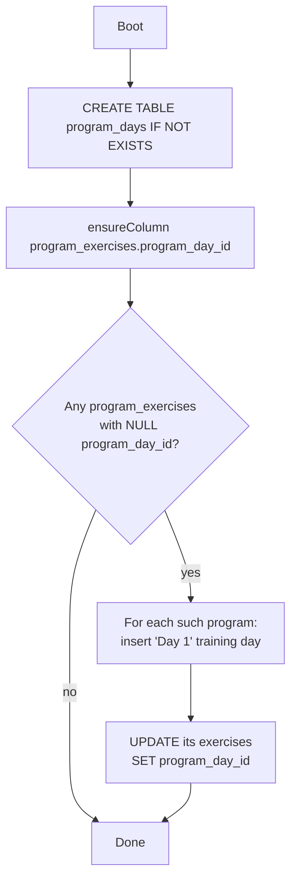
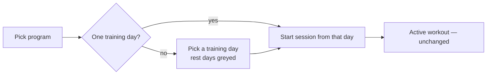

# Program Days — Design Spec

**Date:** 2026-07-19
**Branch:** `feat/program-days`
**Status:** Approved design, pre-implementation

## Problem

Lyftr programs are a flat, single ordered list of exercises:

```
programs
  └─ program_exercises   (order_index, rest_seconds)
       └─ program_sets    (set_number, target_reps, target_weight)
```

There is no grouping layer, so a real training split (Upper/Lower, Push/Pull/Legs)
cannot be represented. There is no notion of days, no rest days, and no way to
start "day 2" of a program. Users can only fake splits by creating one program
per day.

## Goal

Introduce a **day** layer so a program is an ordered list of named days, each
either a training day (has exercises) or a rest day (marker only). When starting
a workout, the user picks which training day to run.

```
programs
  └─ program_days        (NEW: name, order_index, is_rest_day)
       └─ program_exercises   (gains program_day_id; keeps program_id)
            └─ program_sets
```

## Decisions (locked during brainstorming)

| Decision | Choice |
|---|---|
| Scheduling model | **Named days, manual pick.** No calendar/weekday mapping, no auto-advancing cycle. Days are an ordered, named list; the user picks a day when starting a workout. |
| Rest days | Non-startable markers in the day list. They carry no exercises. |
| Structure | **Every program has ≥1 day.** A "simple" routine is a 1-day program; the builder collapses day chrome when there is exactly one day. Single code path — no flat-vs-day branching. |
| Frontends in scope | **Web only.** Mobile (`mobile/`) untouched, but API compatibility is preserved (see below). |
| Existing data | Auto-migrated: each existing program gets one training day named "Day 1" owning its current exercises. |

## Data model

### New table

```sql
CREATE TABLE IF NOT EXISTS program_days (
  id          INTEGER PRIMARY KEY AUTOINCREMENT,
  program_id  INTEGER NOT NULL REFERENCES programs(id) ON DELETE CASCADE,
  name        TEXT    NOT NULL,
  order_index INTEGER NOT NULL DEFAULT 0,
  is_rest_day INTEGER NOT NULL DEFAULT 0
);
CREATE INDEX IF NOT EXISTS idx_program_days_program ON program_days(program_id, order_index);
```

### Altered table

`program_exercises` gains `program_day_id`:

```sql
ALTER TABLE program_exercises ADD COLUMN program_day_id INTEGER
  REFERENCES program_days(id) ON DELETE CASCADE;
```

**`program_id` on `program_exercises` is retained.** The auto-progression code
(`stores/workout_progression.go`, `suggestTargetsTx`, `ResolveSuggestions`) joins
`program_sets → program_exercises` on `pe.program_id`. Keeping that column means
none of the progression SQL changes and the IDOR guards stay intact. Exercises are
now *grouped and loaded* by `program_day_id`; `program_id` is a denormalized parent
pointer kept in sync on every write.

### Migration / backfill

Follows the existing idempotent pattern in `backend/db/migrations.go`
(`ensureColumn` + `PRAGMA table_info`). On boot:

1. `CREATE TABLE IF NOT EXISTS program_days` (added to the `schema` const).
2. `ensureColumn("program_exercises", "program_day_id", ...)`.
3. **Backfill** (runs only when there is orphaned data): for every program that
   has `program_exercises` with `program_day_id IS NULL`, create one
   `program_days` row (`name='Day 1'`, `order_index=0`, `is_rest_day=0`) and set
   those exercises' `program_day_id` to it. Idempotent: a second boot finds no
   NULL rows and does nothing.



## Backend changes

### models.go

```go
type Program struct {
    ID        int64        `json:"id"`
    UserID    int64        `json:"user_id,omitempty"`
    Name      string       `json:"name"`
    Notes     string       `json:"notes"`
    CreatedAt time.Time    `json:"created_at"`
    Days      []ProgramDay `json:"days"`
    // Exercises retained as a READ-ONLY flattened convenience field: every
    // training day's exercises concatenated in day/exercise order. Keeps the
    // untouched mobile client and any existing API consumer from breaking on
    // reads. Never populated from requests.
    Exercises []ProgramExercise `json:"exercises"`
}

type ProgramDay struct {
    ID         int64             `json:"id,omitempty"`
    ProgramID  int64             `json:"program_id,omitempty"`
    Name       string            `json:"name"`
    OrderIndex int               `json:"order_index"`
    IsRestDay  bool              `json:"is_rest_day"`
    Exercises  []ProgramExercise `json:"exercises"`
}
```

`ProgramExercise` gains `ProgramDayID int64 json:"program_day_id,omitempty"`.

Request types nest days:

```go
type CreateProgramRequest struct {
    Name  string                `json:"name" validate:"required"`
    Notes string                `json:"notes"`
    Days  []CreateProgramDayReq `json:"days" validate:"max=14,dive"`
    // Legacy flat field: if Days is empty and Exercises is set, the store wraps
    // them into a single "Day 1" training day. Preserves old web/mobile writes.
    Exercises []CreateProgramExerciseReq `json:"exercises" validate:"max=500,dive"`
}

type CreateProgramDayReq struct {
    Name      string                     `json:"name"`
    IsRestDay bool                       `json:"is_rest_day"`
    Exercises []CreateProgramExerciseReq `json:"exercises" validate:"max=500,dive"`
}
```

**Caps:** max 14 days per program; existing per-exercise/per-set caps unchanged.

### stores/program.go

- `insertProgramExercises` → split into `insertProgramDays(tx, pid, days)` which,
  per day, inserts the `program_days` row then its exercises (passing both
  `program_id` and `program_day_id`). A helper normalizes a `CreateProgramRequest`:
  if `Days` is empty, wrap `Exercises` into one training day named "Day 1".
- `loadExercises` → `loadDays(programID)`: load days ordered by `order_index`,
  then per day load its exercises (reuse the existing close-cursor-before-children
  pattern from #36), then sets. Populate both `Program.Days` and the flattened
  `Program.Exercises` (training days only, in order).
- `Create` / `Update` / `Get` / `List` / `get`: swap `loadExercises` for `loadDays`
  and `insertProgramExercises` for `insertProgramDays`. `Update` still
  `DELETE FROM program_exercises WHERE program_id = ?` then also
  `DELETE FROM program_days WHERE program_id = ?` before re-inserting (cascade
  handles sets).
- Progression functions (`suggestTargetsTx`, `ResolveSuggestions`, `SuggestTargets`):
  **unchanged** — they key off `program_id` and `program_set_id`, both preserved.

### controllers/programs.go

- Validate:
  - Each day `name` defaults to "Day N" (by order) when blank.
  - A rest day carrying exercises → 400 (rest days are markers only).
  - A program with zero training days → 400 (there must be something to run).
  - A training day may have zero exercises (allowed mid-build; starting from it
    just yields an empty session, same as quick-start).
  - More than 14 days → 400.
- Otherwise thin pass-through; ownership + tx already handled in the store.

### No route changes

`GET/POST/PUT/DELETE /programs` and `/programs/:id/suggestions/resolve` keep their
paths and verbs. Only request/response bodies gain the `days` array.

## Web changes

### types.ts / services/api.ts

Mirror the nested shape: add `ProgramDay`, add `days` to `Program`, add
`program_day_id` to `ProgramExercise`. Keep reading `exercises` where the flattened
field is still convenient (e.g. the program card's exercise count can sum across days).

### Program builder — AddProgram / EditProgram (+ modals)

- Day sections (stacked or tabbed): each day has a name field, a rest-day toggle,
  and its own exercise list with the existing add/reorder/set editors.
- "Add day" and "Add rest day" buttons; reorder days; delete day.
- When a program has exactly one training day, collapse the day chrome so a simple
  routine still feels like today's flat builder.
- Rest day: toggling on hides/clears its exercise list.

### Start-workout flow — StartWorkout.tsx / ProgramPicker.tsx

- After selecting a program, present its training days (rest days shown greyed,
  non-selectable). Single-training-day programs skip straight to start.
- `startFromProgram(program, day)` maps the chosen **day's** `exercises` into the
  active session (today it maps `program.exercises`). Everything downstream
  (active session, set logging, `program_set_id` linkage, progression) is unchanged.



## Testing

**Go (table-driven, matching existing style):**
- Store round-trip: create multi-day program (incl. a rest day) → get → assert day
  order, rest flag, per-day exercises/sets.
- Legacy write path: `CreateProgramRequest` with flat `Exercises` and no `Days`
  wraps into a single "Day 1".
- Backfill migration: seed a pre-days program (exercises with NULL
  `program_day_id`), run migration, assert one "Day 1" owns them; second run is a
  no-op.
- Validation: rest day with exercises → 400; program with zero training days → 400;
  >14 days → 400.
- Cascade: delete program removes days, exercises, sets; delete day removes its
  exercises/sets.
- Progression regression: existing `progression_test.go` / `programs_test.go`
  still pass unchanged (proves `program_id` retention worked).

**Web (Playwright, extend `e2e/programs.spec.ts`):**
- Build a 2-training-day + 1-rest-day program, save, reload, assert structure.
- Start a workout from a specific day and confirm the session has that day's
  exercises.

## Backward compatibility summary

| Consumer | Effect |
|---|---|
| Existing DB | Auto-migrated to 1-day programs on first boot; no data loss. |
| Web app | Updated in this effort. |
| Mobile app | Not updated. Reads still work (flattened `exercises` retained). Writes still work (legacy flat `exercises` accepted, wrapped into "Day 1"). Multi-day authoring simply isn't available there until a later pass. |
| Progression / suggestions | Untouched; `program_id` + `program_set_id` preserved. |

## Out of scope (YAGNI)

- Weekday/calendar mapping and auto-advancing cycles.
- Program-level scheduling, streaks, or "today's workout" logic.
- Mobile multi-day authoring UI.
- Reordering exercises *across* days via drag (reorder within a day only for v1).
